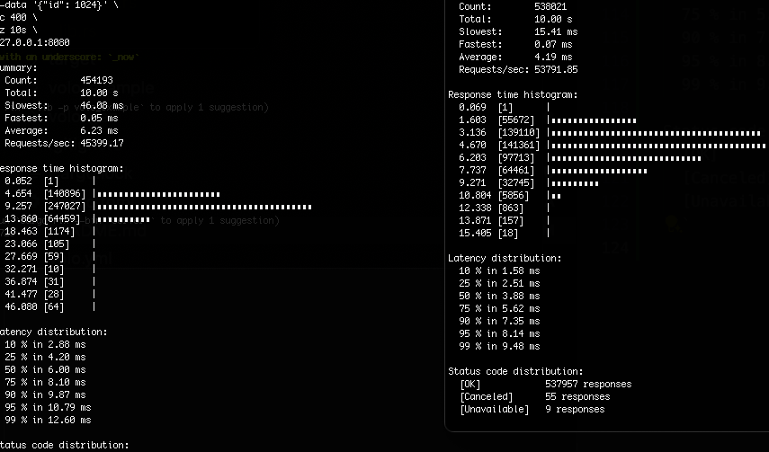

# volo-example
volo-example


参考：
https://www.cloudwego.io/zh/docs/volo/volo-grpc/getting-started/

```
volo init --includes=idl volo-example idl/volo_example.proto

volo idl add idl/volo_example.proto

cargo update && cargo build


# 运行服务端
cargo run --bin server
# 运行客户端
cargo run --bin client

```

## benchmark
* request
```
ghz --insecure \
--proto   api/user/service/v1/oauth.proto \
--import-paths  third_party \
--call api.oauth.service.v1.Oauth.Logout \
-c 200 \
-z 10s \
127.0.0.1:9001

```
* result
```

Summary:
  Count:	454193
  Total:	10.00 s
  Slowest:	46.08 ms
  Fastest:	0.05 ms
  Average:	6.23 ms
  Requests/sec:	45399.17

Response time histogram:
  0.052  [1]      |
  4.654  [140896] |∎∎∎∎∎∎∎∎∎∎∎∎∎∎∎∎∎∎∎∎∎∎∎
  9.257  [247027] |∎∎∎∎∎∎∎∎∎∎∎∎∎∎∎∎∎∎∎∎∎∎∎∎∎∎∎∎∎∎∎∎∎∎∎∎∎∎∎∎
  13.860 [64459]  |∎∎∎∎∎∎∎∎∎∎
  18.463 [1174]   |
  23.066 [105]    |
  27.669 [59]     |
  32.271 [10]     |
  36.874 [31]     |
  41.477 [28]     |
  46.080 [64]     |

Latency distribution:
  10 % in 2.88 ms 
  25 % in 4.20 ms 
  50 % in 6.00 ms 
  75 % in 8.10 ms 
  90 % in 9.87 ms 
  95 % in 10.79 ms 
  99 % in 12.60 ms 

Status code distribution:
  [OK]            453854 responses   
  [Canceled]      218 responses      
  [Unavailable]   121 responses  
```


## another Go FrameWork[include middleware]
* request
```
ghz --insecure \
--proto   api/user/service/v1/oauth.proto \
--import-paths  third_party \
--call api.oauth.service.v1.Oauth.Logout \
-c 400 \
-z 10s \
127.0.0.1:9001
```
* result
```

Summary:
  Count:	538021
  Total:	10.00 s
  Slowest:	15.41 ms
  Fastest:	0.07 ms
  Average:	4.19 ms
  Requests/sec:	53791.85

Response time histogram:
  0.069  [1]      |
  1.603  [55672]  |∎∎∎∎∎∎∎∎∎∎∎∎∎∎∎∎
  3.136  [139110] |∎∎∎∎∎∎∎∎∎∎∎∎∎∎∎∎∎∎∎∎∎∎∎∎∎∎∎∎∎∎∎∎∎∎∎∎∎∎∎
  4.670  [141361] |∎∎∎∎∎∎∎∎∎∎∎∎∎∎∎∎∎∎∎∎∎∎∎∎∎∎∎∎∎∎∎∎∎∎∎∎∎∎∎∎
  6.203  [97713]  |∎∎∎∎∎∎∎∎∎∎∎∎∎∎∎∎∎∎∎∎∎∎∎∎∎∎∎∎
  7.737  [64461]  |∎∎∎∎∎∎∎∎∎∎∎∎∎∎∎∎∎∎
  9.271  [32745]  |∎∎∎∎∎∎∎∎∎
  10.804 [5856]   |∎∎
  12.338 [863]    |
  13.871 [157]    |
  15.405 [18]     |

Latency distribution:
  10 % in 1.58 ms 
  25 % in 2.51 ms 
  50 % in 3.88 ms 
  75 % in 5.62 ms 
  90 % in 7.35 ms 
  95 % in 8.14 ms 
  99 % in 9.48 ms 

Status code distribution:
  [OK]            537957 responses   
  [Canceled]      55 responses       
  [Unavailable]   9 responses 
```

